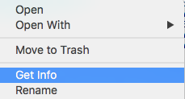
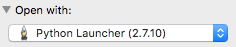
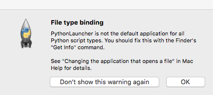
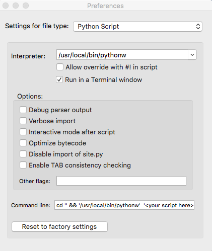

# Pre-requisite

1. python:  the python installation need to have tkinter package.  Check it by
`import Tkinter` from your python interpreter.
2. ipython notebook
3. **python Launcher** application.

# Mac Installation

1. Download gui.py from [here](https://raw.githubusercontent.com/jiayiliu/inlauncher/master/gui.py) to any folder that you want to start your ipython notebook.
2. Right click the *gui.py*, choose *Get Info*.

	

3. In the *Get Info* panel, find *Open with* tab, then choose *Python Launcher* to open the *gui.py*.  Then you can close the panel.  You do not need to *Change All...*.

	

4. Now you can double click the *gui.py* file.  Then a dialog panel will prompt out for the first time.  Choose *Open*.  No worry if it doesn't show up.

5. For the first time, it will prompt several windows, like terminal, File type binding notice, python Launcher panel, and the application interface.

	a. Close *File type binding* panel by click *Don't show this warning again*

		
	
	b. In the python Launcher panel, DO NOT check off *Run in a Terminal window*.
		
		
	
	c. Now you can close the *inlauncher* app and terminals.  Next time, when you open the *gui.py* application, no terminal will show up again.

<!--- In the python Launcher panel, check off *Run in a Terminal window*.  If this window disappeared, you can open the *gui.py* again. --->
	
# Ubuntu Installation

1. Download gui.py from [here](https://raw.githubusercontent.com/jiayiliu/inlauncher/master/gui.py) to your folder.

2. Download the application launcher [inlauncher.desktop](https://raw.githubusercontent.com/jiayiliu/inlauncher/master/inlauncher.desktop) for a quick-launcher.

3. Edit the file inlauncher.desktop.  Change *full_path_to_gui.py* to your path to the *gui.py* file.

4. Click *inlauncher.desktop* and enjoy ipython notebook.